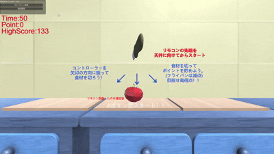

# 食材を切れ!! 🔪

## 概要

食材を切れ!! は，Wiiリモコンを用いた体感型アクションゲームです。

プレイヤーはWiiリモコンを包丁のように振り，画面上に出現する食材を切ってスコアを獲得します。  
キーボードやマウスではなく，実際に腕を振る動作をゲーム内のアクションに反映させることで，直感的で爽快感のある操作体験を目指しました。

Unityでのゲーム制作において，外部デバイスを用いた入力処理に挑戦した作品です。

## デモ

  
  

## 開発背景

通常のPCゲームでは，キーボードやマウスを用いた操作が中心になります。  
一方で，Wiiリモコンのような外部デバイスを利用することで，プレイヤーの身体動作とゲーム内のアクションを直接結びつけられると考えました。

そこで，Wiiリモコンを包丁に見立て，実際に腕を振ることで食材を切るアクションゲームを制作しました。  
単にセンサ値を取得するだけでなく，プレイヤーが「振った」と感じる動作を自然にゲーム内へ反映することを意識しました。

## 主な機能

- Wiiリモコンの加速度センサを用いた入力処理
- リモコンを振る動作に応じた切断判定
- 食材の出現とスコア加算
- 切断成功時の即時フィードバック
- 方向判定や連続操作を用いた複数のゲームモード
- 実際の動作とゲーム内のアクションを連動させた体感的な操作

## 使用技術

- Unity
- C#
- Wiiリモコン
- 外部ライブラリ
- 加速度センサ
- 赤外線センサ

## 実装概要

### Wiiリモコンの入力取得

外部ライブラリを使用し，Wiiリモコンのボタン入力，加速度センサの値，赤外線センサの情報を取得しました。  
取得したセンサ値をUnity側で扱い，ゲーム内の入力として利用しています。

### センサ値を用いた切断判定

Wiiリモコンの加速度センサから得られる値をもとに，プレイヤーがリモコンを振ったかどうかを判定しています。  
加速度の大きさや変化を確認し，一定以上の動きがあった場合に食材を切ったと判定するようにしました。

### 操作とゲーム内アクションの連動

プレイヤーが実際にリモコンを振ったタイミングと，ゲーム内で食材が切れるタイミングがずれると，操作の気持ちよさが損なわれます。  
そのため，入力判定の条件やフィードバックのタイミングを調整し，プレイヤーの動作とゲーム内の反応が自然につながるようにしました。

## 工夫した点

### センサ値のばらつきへの対応

加速度センサの値は，リモコンの向きや振り方によって大きく変化し，微小な動きでも値が揺れます。  
そのため，単純にセンサ値が一定以上になっただけで判定すると，意図しない動作でも食材を切ったことになってしまう問題がありました。

そこで，実際にリモコンを振りながらセンサ値の変化を確認し，食材を切ったと判定するための閾値や条件を調整しました。  
弱い動きでは反応しすぎず，十分に振ったときには確実に反応するように試行錯誤しました。

### 体感的な操作の実現

このゲームでは，プレイヤーが「自分の動作で食材を切っている」と感じられることを重視しました。  
そのため，切断に成功した際にはスコア加算や画面上の変化を即座に反映し，プレイヤーの動作と結果が結びつきやすいようにしました。

### ゲーム性の追加

単に食材を切るだけでは操作が単調になりやすいため，方向判定や連続操作などの要素を追加しました。  
Wiiリモコンを振るという操作を単発のギミックで終わらせず，ゲームとして楽しめる体験につなげることを意識しました。

## 苦労した点

最も苦労した点は，Wiiリモコンのセンサ値を安定したゲーム入力として扱うことです。  
加速度センサの値にはばらつきがあり，プレイヤーの意図しない小さな動きでも反応してしまうことがありました。

一方で，判定を厳しくしすぎると，プレイヤーが振っているのに反応しないという違和感が生じます。  
そのため，誤検出を抑えながら操作の爽快感を損なわないように，閾値や判定条件を何度も調整しました。

## 実行方法

本プロジェクトの実行には以下が必要です。

- Wiiリモコン
- センサバー
- Bluetooth接続環境
- Unity実行環境
- Wiiリモコン接続用の外部ライブラリ

環境によっては，Bluetooth接続や外部ライブラリの設定が追加で必要になる場合があります。

## 今後の改善案

- センサ値の処理を改善し，操作精度をさらに向上させる
- 食材の種類や演出を増やし，ゲームとしての楽しさを高める
- UIや効果音を強化し，切ったときの爽快感を高める
- 他のジェスチャー操作を追加する
- スコアランキングや制限時間モードを追加する
