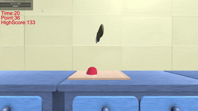

# 食材を切れ!! 🔪

## 概要
Wiiリモコンを用いた直感的な操作で食材を切るアクションゲームです。  
リモコンの動きに応じて包丁を操作でき、実際に腕を振ることで食材を切る体験を再現しています。

---

## デモ

---

## 特徴
- Wiiリモコンの加速度センサを用いた入力処理
- 実際の動作とゲーム内の動きを同期した直感的な操作
- 即時フィードバックによる爽快なゲーム体験
- 複数のゲームモード（方向判定・連続操作）

---

## 使用技術
- Unity
- C#
- Wiiリモコン（外部ライブラリ使用）
- 加速度センサ / 赤外線センサ

---

## 実装概要

### ■ Wiiリモコンの入力取得
外部ライブラリを使用し、Wiiリモコンのボタン入力および加速度センサの値を取得しています。  
また、センサバーを利用することでリモコンの向きや位置情報も取得可能としています。

---

### ■ センサ値の処理
取得した加速度データにはノイズが含まれるため、閾値処理や条件分岐を行い、  
意図した動作（上下・左右の振り）を正しく検出できるよう調整しました。

---

### ■ 操作とゲームへの反映
プレイヤーの動きとゲーム内の包丁の動きが一致するように設計し、  
直感的に操作できるようにしています。

---

## 苦労した点
センサ値のばらつきにより、意図しない入力が発生する問題がありました。  
これに対して閾値の調整や入力条件の工夫を行い、誤検出を抑えつつ操作性を向上させました。

---

## 実行方法
本プロジェクトの実行には以下が必要です：

- Wiiリモコン
- センサバー
- Bluetooth接続環境
- Unity実行環境

※ 環境によっては追加設定が必要です。

---

## 今後の改善
- 操作精度のさらなる向上
- UIや演出の強化
- 他のジェスチャー操作の追加

---
