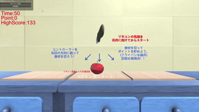
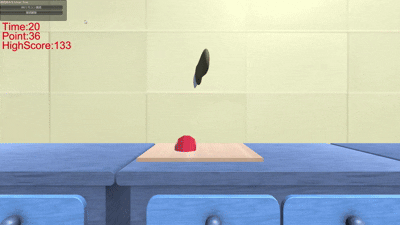

# 食材を切れ!! 🔪

## 概要

「食材を切れ!!」は、Wiiリモコンを用いた体感型アクションゲームです。
プレイヤーはWiiリモコンを包丁のように振り、画面上に出現する食材を切ってスコアを獲得します。

大学講義内で約1か月かけて、1人で企画、実装、動作確認、調整まで行いました。
Unityでのゲーム制作において、外部デバイスから取得した入力をゲーム内アクションに変換することに挑戦した作品です。

## デモ

  
  

## 開発背景

通常のPCゲームでは、キーボードやマウスを用いた操作が中心になります。
一方で、Wiiリモコンのような外部デバイスを利用すれば、プレイヤーの身体動作とゲーム内のアクションを結びつけたゲーム体験を作れると考えました。

そこで、Wiiリモコンを包丁に見立て、実際に腕を振ることで食材を切るアクションゲームを制作しました。
単にセンサ値を取得するだけでなく、プレイヤーが「振った」と感じる動作を、ゲーム内の切断アクションとして自然に反映することを重視しました。

## 主な機能

* Wiiリモコンの加速度情報を用いた入力処理
* WiiリモコンのIRカメラとセンサバーを用いた入力取得
* リモコンを振る動作に応じた切断判定
* 食材の出現とスコア加算
* 切断成功時の画面変化によるフィードバック
* 動作方向や連続操作を用いたゲーム性の追加
* プレイヤーの身体動作とゲーム内アクションの連動

## 使用技術

* Unity
* C#
* Wiiリモコン
* Wiiリモコン接続用の外部ライブラリ
* 加速度センサ
* IRカメラ
* センサバー
* Bluetooth接続

## 実装概要

### Wiiリモコンの入力取得

外部ライブラリを使用し、Wiiリモコンのボタン入力、加速度情報、IRカメラによる赤外線情報を取得しました。
センサバーを赤外線の基準点として利用し、Wiiリモコン側で取得した情報をUnity側のゲーム内入力として扱っています。

### 加速度情報を用いた切断判定

Wiiリモコンの加速度情報をもとに、プレイヤーがリモコンを振ったかどうかを判定しています。
一定以上の加速度が発生した場合に食材を切ったと判定し、ゲーム内のアクションやスコア加算に反映しました。

### 操作とゲーム内アクションの連動

プレイヤーが実際にリモコンを振ったタイミングと、ゲーム内で食材が切れるタイミングがずれると、操作感が損なわれます。
そのため、入力判定の条件や反応タイミングを調整し、腕を振る動作と画面上の切断アクションがつながって見えるようにしました。

## 工夫した点

### センサ値のばらつきへの対応

加速度センサの値は、リモコンの向きや振り方によって大きく変化します。
また、小さな動きでも値が揺れるため、単純にセンサ値が一定以上になっただけで判定すると、意図しない動作でも食材を切ったことになってしまう問題がありました。

そこで、実際にリモコンを複数方向に振りながら加速度の変化を確認し、切断判定に用いるしきい値や条件を調整しました。
弱い動きでは反応しすぎず、十分に振ったときには反応するように、誤検知の少なさと反応しやすさのバランスを意識しました。

### 身体動作とゲーム体験の連動

このゲームでは、プレイヤーが「自分の動作で食材を切っている」と感じられることを重視しました。
そのため、切断に成功した際にはスコア加算や画面上の変化をすぐに反映し、プレイヤーの動作と結果が結びつきやすいようにしました。

### ゲーム性の追加

単に食材を切るだけでは操作が単調になりやすいため、動作方向や連続操作などの要素を追加しました。
Wiiリモコンを振るという操作を単発のギミックで終わらせず、ゲームとして楽しめる体験につなげることを意識しました。

## 苦労した点

最も苦労した点は、Wiiリモコンの加速度情報を安定したゲーム入力として扱うことです。
加速度の値にはばらつきがあり、プレイヤーの意図しない小さな動きでも反応してしまうことがありました。

一方で、判定を厳しくしすぎると、プレイヤーが振っているのに反応しないという違和感が生じます。
そのため、誤検知を抑えながら操作感を損なわないように、しきい値や判定条件、反応タイミングを何度も調整しました。

また、自分の振り方だけを基準にすると、他の人が遊んだときに反応しづらくなる可能性がありました。
そのため、複数の振り方を試しながら、操作のばらつきを考慮した判定条件にすることを意識しました。

## 実行方法

本プロジェクトの実行には以下が必要です。

* Wiiリモコン
* センサバー
* Bluetooth接続環境
* Unity実行環境
* Wiiリモコン接続用の外部ライブラリ

環境によっては、Bluetooth接続や外部ライブラリの設定が追加で必要になる場合があります。

## 今後の改善案

* 加速度情報の処理を改善し、操作精度をさらに向上させる
* 食材の種類や演出を増やし、ゲームとしての楽しさを高める
* UIや効果音を強化し、切ったときのフィードバックを分かりやすくする
* 他のジェスチャー操作を追加する
* スコアランキングや制限時間モードを追加する

## 補足

本リポジトリは、大学講義内で制作した作品を公開用に整理したものです。
主要なC#スクリプトと、Wiiリモコン入力を用いた判定処理の概要を掲載しています。
